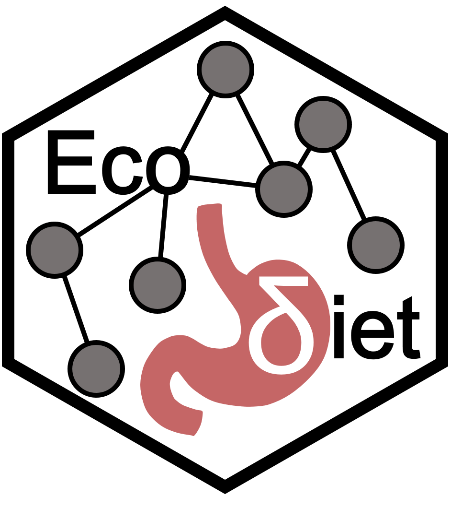

# EcoDiet

*This is a work in progress!*

EcoDiet is an R package so before anything, you should download and install/update R.

## JAGS installation

EcoDiet relies on the JAGS program to run so you will also need to download and install JAGS.

#### For Windows users

You can:

To ensure JAGS is found by the R program, precise its path with this command in R:
```
Sys.setenv(JAGS_HOME='****/Program Files/JAGS/JAGS-4.2.0')
```

#### For MacOS and Linux users (simple procedure)

Try this command if you are on MacOS:
```
sudo brew install jags
```

or this command if you are on Linux:
```
sudo apt-get install jags
```

If you get an error message during installation, pleasure try the longer procedure described below.

#### For MacOS and Linux users (longer procedure)

* You need to first download JAGS source code from [here](https://sourceforge.net/projects/mcmc-jags/). The file you will get should look like this: `JAGS-4.3.0.tar.gz`. (The version number will change with time.)

* You will then need to uncompress the file with this bash command on the terminal:
```
tar -xzf JAGS-4.3.0.tar.gz
```
And go within the JAGS folder:
```
cd JAGS-4.3.0/
```

* Finally you can install JAGS with this serie of commands:
```
./configure
make
sudo make install
```

## To install the EcoDiet package

You can download the EcoDiet package with this command in R:
```
devtools::install_github("heloisethero/EcoDiet", auth_token='c570f1b55d68a8ae0fb38428155e19a426814d15')
```

## To learn how to use EcoDiet

The vignettes will then explain to you how to use this package. To access the vignette you can run in R:
```
browseVignettes("EcoDiet")
```
or:
```
vignette("EcoDiet_vignette")
```


